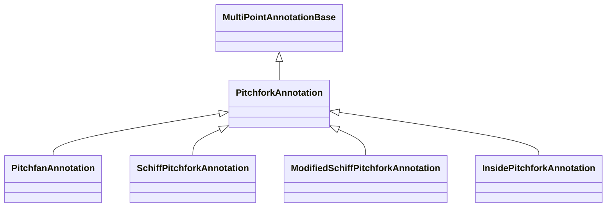

# Pitchfork Annotations

Pitchfork annotations draw three-point fan and fork structures. `PitchforkAnnotation` is the core Andrews' Pitchfork geometry, and the other variants keep the same three-point editing model while shifting the virtual handle or guide ray in different ways.

## Annotation Types

| Annotation | Main Use |
| --- | --- |
| [PitchforkAnnotation](/scichart-extensions/scichart-financial-tools/annotation-types/pitchfork-annotations/pitchfork-annotation/) | Andrews' Pitchfork with optional zones. |
| [PitchfanAnnotation](/scichart-extensions/scichart-financial-tools/annotation-types/pitchfork-annotations/pitchfan-annotation/) | Pitchfork-based fan rays with an optional shoulder line. |
| [SchiffPitchforkAnnotation](/scichart-extensions/scichart-financial-tools/annotation-types/pitchfork-annotations/schiff-pitchfork-annotation/) | Schiff variant with an inward virtual handle. |
| [ModifiedSchiffPitchforkAnnotation](/scichart-extensions/scichart-financial-tools/annotation-types/pitchfork-annotations/modified-schiff-pitchfork-annotation/) | Midpoint-based Schiff variant. |
| [InsidePitchforkAnnotation](/scichart-extensions/scichart-financial-tools/annotation-types/pitchfork-annotations/inside-pitchfork-annotation/) | Inward pitchfork variant with an inside guide ray. |

#### See Also

- [Channel annotations](/scichart-extensions/scichart-financial-tools/annotation-types/channel-annotations/)
- [Adorner properties](/scichart-extensions/scichart-financial-tools/annotation-types/adorner-properties/)
- [Multi-Point Labels Deep Dive](/scichart-extensions/scichart-financial-tools/annotation-types/multipoint-annotations/)
