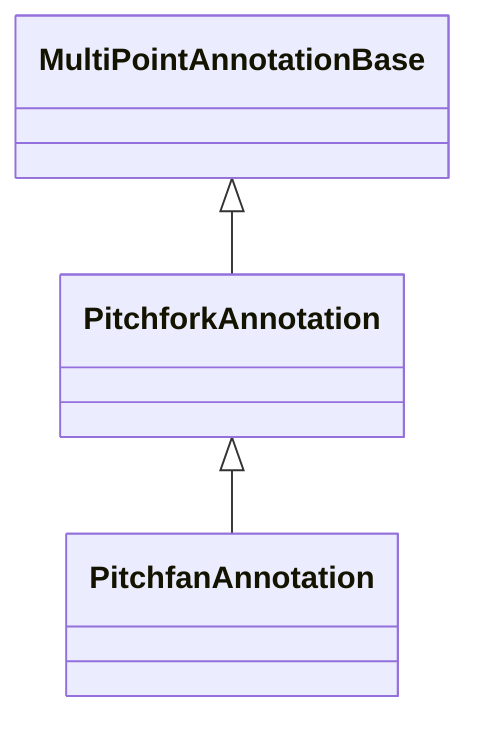

# Pitchfork Annotations

Pitchfork annotations draw three-point fan and fork structures. `PitchfanAnnotation` extends `PitchforkAnnotation`, so the two pages live together here. If a Schiff Pitchfork lands later, this is where it fits.

## Annotation Types

| Annotation | Main Use |
| --- | --- |
| [PitchforkAnnotation](/scichart-extensions/scichart-financial-tools/annotation-types/pitchfork-annotations/pitchfork-annotation/) | Andrews' Pitchfork with optional zones. |
| [PitchfanAnnotation](/scichart-extensions/scichart-financial-tools/annotation-types/pitchfork-annotations/pitchfan-annotation/) | Pitchfork-based fan rays. |

#### See Also

- [Channel annotations](/scichart-extensions/scichart-financial-tools/annotation-types/channel-annotations/)
- [Multi-Point Labels Deep Dive](/scichart-extensions/scichart-financial-tools/annotation-types/multipoint-annotations/)
