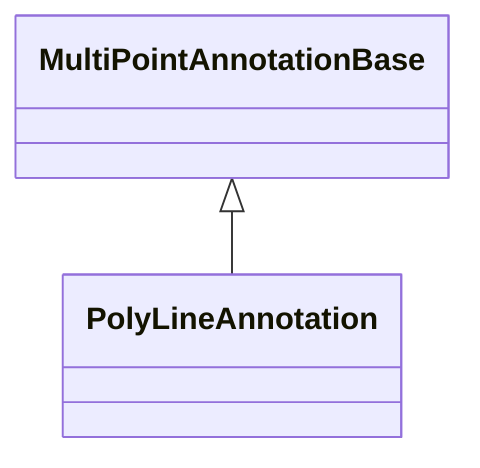

# Polyline Annotations

Polyline annotations are built from ordered placement points. Each point becomes a vertex, and the annotation draws straight segments through those vertices.

| Annotation | Polyline behavior |
| --- | --- |
| [PolyLineAnnotation](/scichart-extensions/scichart-financial-tools/annotation-types/polyline-annotations/polyline-annotation/) | The default [PolyLineAnnotation:blue_book:](https://www.scichart.com/documentation/js/v5/typedoc-fin-tools/classes/polylineannotation.html), drawing editable line segments through the `points` array. |
| [XABCD pattern](/scichart-extensions/scichart-financial-tools/annotation-types/polyline-annotations/xabcd-pattern/) | A five-point labelled pattern using `placementPointCount: 5` when created through the placement modifier. |
| [Elliott patterns](/scichart-extensions/scichart-financial-tools/annotation-types/polyline-annotations/elliott-patterns/) | A set of labelled Elliott-pattern examples using 6 ordered polyline points. |

These examples use the same [PolyLineAnnotation:blue_book:](https://www.scichart.com/documentation/js/v5/typedoc-fin-tools/classes/polylineannotation.html) class. Patterns such as XABCD, Elliott patterns and other multi-leg shapes are configured by changing the `points`, labels, styling and `placementPointCount`; no extra annotation subclass is required.

#### See Also

- [PolyLineAnnotation](/scichart-extensions/scichart-financial-tools/annotation-types/polyline-annotations/polyline-annotation/)
- [XABCD pattern](/scichart-extensions/scichart-financial-tools/annotation-types/polyline-annotations/xabcd-pattern/)
- [Elliott patterns](/scichart-extensions/scichart-financial-tools/annotation-types/polyline-annotations/elliott-patterns/)
- [SVG drag points](/scichart-extensions/scichart-financial-tools/annotation-types/svg-drag-points/)
- [Keyboard shortcuts](/scichart-extensions/scichart-financial-tools/annotation-types/keyboard-shortcuts/)
- [Adorner properties](/scichart-extensions/scichart-financial-tools/annotation-types/adorner-properties/)
- [Multi-Point Labels Deep Dive](/scichart-extensions/scichart-financial-tools/annotation-types/multipoint-annotations/)
- [Placement and Editing](/scichart-extensions/scichart-financial-tools/modifiers/placement-and-editing/)
