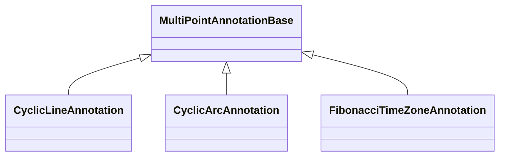

# Repeating / Cyclic Annotations

These annotations project repeating line, arc or time-zone patterns forward from a measured reference.

## Annotation Types

| Annotation | Main Use |
| --- | --- |
| [CyclicLineAnnotation](/scichart-extensions/scichart-financial-tools/annotation-types/repeating-cyclic-annotations/cyclic-line-annotation/) | Repeating projected line. |
| [CyclicArcAnnotation](/scichart-extensions/scichart-financial-tools/annotation-types/repeating-cyclic-annotations/cyclic-arc-annotation/) | Repeating projected arc. |
| [FibonacciTimeZoneAnnotation](/scichart-extensions/scichart-financial-tools/annotation-types/repeating-cyclic-annotations/fibonacci-time-zone-annotation/) | Fibonacci time-zone projections. |

#### See Also

- [Fibonacci annotations](/scichart-extensions/scichart-financial-tools/annotation-types/fibonacci-annotations/)
- [Multi-Point Labels Deep Dive](/scichart-extensions/scichart-financial-tools/annotation-types/multipoint-annotations/)
