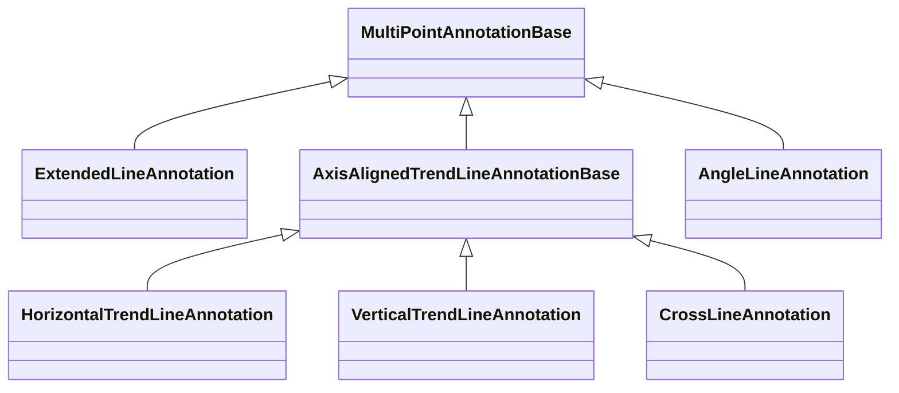

# Trend Line Annotations

These annotations draw directional or reference lines on a chart. `ExtendedLineAnnotation` and `AngleLineAnnotation` use two points, while the axis-aligned line types use a single anchor point to produce horizontal, vertical or cross-style guides.

## Annotation Types

| Annotation | Main Use |
| --- | --- |
| [ExtendedLineAnnotation](/scichart-extensions/scichart-financial-tools/annotation-types/trend-line-annotations/extended-line-annotation/) | Two-point trend line that can extend as a ray or infinite line. |
| [HorizontalTrendLineAnnotation](/scichart-extensions/scichart-financial-tools/annotation-types/trend-line-annotations/horizontal-trend-line-annotation/) | Axis-aligned horizontal support / resistance line. |
| [VerticalTrendLineAnnotation](/scichart-extensions/scichart-financial-tools/annotation-types/trend-line-annotations/vertical-trend-line-annotation/) | Axis-aligned vertical time marker line. |
| [CrossLineAnnotation](/scichart-extensions/scichart-financial-tools/annotation-types/trend-line-annotations/cross-line-annotation/) | Axis-aligned cross-style guide marker. |
| [AngleLineAnnotation](/scichart-extensions/scichart-financial-tools/annotation-types/trend-line-annotations/angle-line-annotation/) | Angled directional guide line. |

#### See Also

- [ExtendedLineAnnotation](/scichart-extensions/scichart-financial-tools/annotation-types/trend-line-annotations/extended-line-annotation/)
- [Multi-Point Labels Deep Dive](/scichart-extensions/scichart-financial-tools/annotation-types/multipoint-annotations/)
