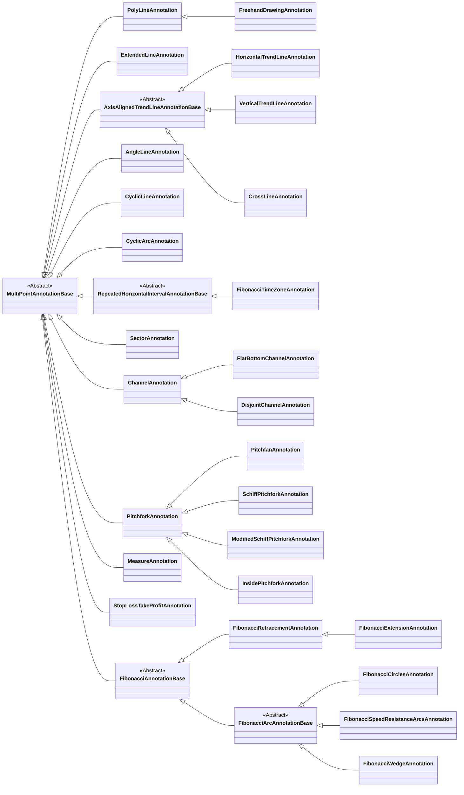

# "scichart-financial-tools" Overview

`scichart-financial-tools` provides trading annotations, trading modifiers, trader themes, OHLC data filters and the label / snapping enums used by the examples in this section. The annotation types share [MultiPointAnnotationBase:blue_book:](https://www.scichart.com/documentation/js/v5/typedoc-fin-tools/classes/multipointannotationbase.html), [PolyLineAnnotation:blue_book:](https://www.scichart.com/documentation/js/v5/typedoc-fin-tools/classes/polylineannotation.html), and [FreehandDrawingAnnotation:blue_book:](https://www.scichart.com/documentation/js/v5/typedoc-fin-tools/classes/freehanddrawingannotation.html).

<ChartFromSciChartDemo
    src="https://www.scichart.com/demo/iframe/trading-drawing-tools"
    title="Trading Drawing Tools"
    description=""
/>

For the full API reference, see [API Documentation:blue_book:](https://www.scichart.com/documentation/js/v5/typedoc-fin-tools/index.html).

The annotations integrate with normal SciChart.js surfaces and axes, but their multi-point editing model lives in `scichart-financial-tools`. Use this page as the map; the individual pages contain the focused live examples.

```bash
npm i scichart scichart-financial-tools
```

## Annotation Types

| Annotation | Placement Points | Main Use |
| --- | --- | --- |
| [PolyLineAnnotation:blue_book:](https://www.scichart.com/documentation/js/v5/typedoc-fin-tools/classes/polylineannotation.html) | 2 or more | Base concrete multi-point line / polygon annotation |
| [ExtendedLineAnnotation](/scichart-extensions/scichart-financial-tools/annotation-types/trend-line-annotations/extended-line-annotation/) | 2 | Trend line, ray or infinite line |
| [HorizontalTrendLineAnnotation](/scichart-extensions/scichart-financial-tools/annotation-types/trend-line-annotations/horizontal-trend-line-annotation/) | 1 | Horizontal trend line |
| [VerticalTrendLineAnnotation](/scichart-extensions/scichart-financial-tools/annotation-types/trend-line-annotations/vertical-trend-line-annotation/) | 1 | Vertical trend line |
| [CrossLineAnnotation](/scichart-extensions/scichart-financial-tools/annotation-types/trend-line-annotations/cross-line-annotation/) | 1 | Crosshair-style guide from a single anchor |
| [AngleLineAnnotation](/scichart-extensions/scichart-financial-tools/annotation-types/trend-line-annotations/angle-line-annotation/) | 2 | Angled guide line |
| [CyclicLineAnnotation](/scichart-extensions/scichart-financial-tools/annotation-types/repeating-cyclic-annotations/cyclic-line-annotation/) | 2 | Cyclical projection line |
| [CyclicArcAnnotation](/scichart-extensions/scichart-financial-tools/annotation-types/repeating-cyclic-annotations/cyclic-arc-annotation/) | 2 | Cyclical arc guide |
| [FibonacciTimeZoneAnnotation](/scichart-extensions/scichart-financial-tools/annotation-types/repeating-cyclic-annotations/fibonacci-time-zone-annotation/) | 2 | Fibonacci time-zone projections |
| [PitchforkAnnotation](/scichart-extensions/scichart-financial-tools/annotation-types/pitchfork-annotations/pitchfork-annotation/) | 3 | Andrews' Pitchfork with optional zones |
| [PitchfanAnnotation](/scichart-extensions/scichart-financial-tools/annotation-types/pitchfork-annotations/pitchfan-annotation/) | 3 | Projected fan lines from pitchfork points |
| [SchiffPitchforkAnnotation](/scichart-extensions/scichart-financial-tools/annotation-types/pitchfork-annotations/schiff-pitchfork-annotation/) | 3 | Schiff pitchfork variant with an inward virtual handle |
| [ModifiedSchiffPitchforkAnnotation](/scichart-extensions/scichart-financial-tools/annotation-types/pitchfork-annotations/modified-schiff-pitchfork-annotation/) | 3 | Modified Schiff pitchfork variant with a midpoint virtual handle |
| [InsidePitchforkAnnotation](/scichart-extensions/scichart-financial-tools/annotation-types/pitchfork-annotations/inside-pitchfork-annotation/) | 3 | Inside pitchfork variant with an inward guide ray |
| [SectorAnnotation:blue_book:](https://www.scichart.com/documentation/js/v5/typedoc-fin-tools/classes/sectorannotation.html) | 3 | Circular or radial sector annotation |
| [ChannelAnnotation:blue_book:](https://www.scichart.com/documentation/js/v5/typedoc-fin-tools/classes/channelannotation.html) | 3 placement points, 4 corners | Parallel ChannelAnnotation |
| [FlatBottomChannelAnnotation:blue_book:](https://www.scichart.com/documentation/js/v5/typedoc-fin-tools/classes/flatbottomchannelannotation.html) | 3 placement points, 4 corners | Channel with horizontal lower boundary |
| [DisjointChannelAnnotation:blue_book:](https://www.scichart.com/documentation/js/v5/typedoc-fin-tools/classes/disjointchannelannotation.html) | 3 placement points, 4 corners | Channel with the second side constrained from the first |
| [FibonacciRetracementAnnotation:blue_book:](https://www.scichart.com/documentation/js/v5/typedoc-fin-tools/classes/fibonacciretracementannotation.html) | 2 by default, 3 in skewed mode | Retracement levels, regions and level labels |
| [FibonacciExtensionAnnotation:blue_book:](https://www.scichart.com/documentation/js/v5/typedoc-fin-tools/classes/fibonacciextensionannotation.html) | 3 | Extension levels from a measured trend and start offset |
| [FibonacciCirclesAnnotation:blue_book:](https://www.scichart.com/documentation/js/v5/typedoc-fin-tools/classes/fibonaccicirclesannotation.html) | 2 | Fibonacci circles or ovals from opposite corners |
| [FibonacciSpeedResistanceArcsAnnotation:blue_book:](https://www.scichart.com/documentation/js/v5/typedoc-fin-tools/classes/fibonaccispeedresistancearcsannotation.html) | 2 | Concentric speed resistance arcs from a center and radius |
| [FibonacciWedgeAnnotation:blue_book:](https://www.scichart.com/documentation/js/v5/typedoc-fin-tools/classes/fibonacciwedgeannotation.html) | 3 | Fibonacci arcs constrained inside a wedge |
| [MeasureAnnotation:blue_book:](https://www.scichart.com/documentation/js/v5/typedoc-fin-tools/classes/measureannotation.html) | 2 | Change between two points |
| [StopLossTakeProfitAnnotation:blue_book:](https://www.scichart.com/documentation/js/v5/typedoc-fin-tools/classes/stoplosstakeprofitannotation.html) | 2 | Stop-loss or take-profit zone |
| [FreehandDrawingAnnotation:blue_book:](https://www.scichart.com/documentation/js/v5/typedoc-fin-tools/classes/freehanddrawingannotation.html) | Many sampled points | Editable freehand drawing stored as a polyline |

## Annotation Class Hierarchy



## Modifiers

| Modifier | Main Use |
| --- | --- |
| [MultiPointAnnotationPlacementModifier:blue_book:](https://www.scichart.com/documentation/js/v5/typedoc-fin-tools/classes/multipointannotationplacementmodifier.html) | Click-to-place workflow for supported multi-point annotations. See [Placement and Editing](/scichart-extensions/scichart-financial-tools/modifiers/placement-and-editing/). |
| [MultiPointAnnotationEditorModifier:blue_book:](https://www.scichart.com/documentation/js/v5/typedoc-fin-tools/classes/multipointannotationeditormodifier.html) | Schema-driven editor panel for selected multi-point annotations. See [Annotation editor modifier](/scichart-extensions/scichart-financial-tools/modifiers/multipoint-annotation-editor-modifier/). |
| [AnnotationEraserModifier:blue_book:](https://www.scichart.com/documentation/js/v5/typedoc-fin-tools/classes/annotationerasermodifier.html) | Pointer-driven eraser that removes annotations under a click or drag trail. See [Annotation eraser](/scichart-extensions/scichart-financial-tools/modifiers/annotation-eraser-modifier/). |
| [FreehandDrawingModifier:blue_book:](https://www.scichart.com/documentation/js/v5/typedoc-fin-tools/classes/freehanddrawingmodifier.html) | Captures pointer strokes and creates [FreehandDrawingAnnotation:blue_book:](https://www.scichart.com/documentation/js/v5/typedoc-fin-tools/classes/freehanddrawingannotation.html) instances. See [Freehand drawing modifier](/scichart-extensions/scichart-financial-tools/modifiers/freehand-drawing-modifier/). |
| [SeriesValueModifier:blue_book:](https://www.scichart.com/documentation/js/v5/typedoc-fin-tools/classes/seriesvaluemodifier.html) | Adds y-axis markers that track latest / last-visible renderable series values. See [Series value modifier](/scichart-extensions/scichart-financial-tools/modifiers/series-value-modifier/). |

## Data Filters

| Filter | Main Use |
| --- | --- |
| [OhlcHeikinAshiFilter:blue_book:](https://www.scichart.com/documentation/js/v5/typedoc-fin-tools/classes/ohlcheikinashifilter.html) | Converts OHLC candles to Heikin-Ashi candles |
| [OhlcRenkoFilter:blue_book:](https://www.scichart.com/documentation/js/v5/typedoc-fin-tools/classes/ohlcrenkofilter.html) | Converts OHLC data into Renko bricks |
| [PointAndFigureFilter:blue_book:](https://www.scichart.com/documentation/js/v5/typedoc-fin-tools/classes/pointandfigurefilter.html) | Converts OHLC close values into Point & Figure marks |

See the individual data filter pages for live examples with source / filtered toggles:

- [Heikin-Ashi filter](/scichart-extensions/scichart-financial-tools/data-filters/heikin-ashi/)
- [Renko filter](/scichart-extensions/scichart-financial-tools/data-filters/renko/)
- [Point & Figure filter](/scichart-extensions/scichart-financial-tools/data-filters/point-and-figure/)

## Themes and Enums

[SciTraderDarkTheme:blue_book:](https://www.scichart.com/documentation/js/v5/typedoc-fin-tools/classes/scitraderdarktheme.html) and [SciTraderLightTheme:blue_book:](https://www.scichart.com/documentation/js/v5/typedoc-fin-tools/classes/scitraderlighttheme.html) provide financial-chart styling for examples and applications.

Common trading enum exports include:

- [ETradingAnnotationType:blue_book:](https://www.scichart.com/documentation/js/v5/typedoc-fin-tools/enums/etradingannotationtype.html)
- [ETradingChartModifierType:blue_book:](https://www.scichart.com/documentation/js/v5/typedoc-fin-tools/enums/etradingchartmodifiertype.html)
- [ELastYMode:blue_book:](https://www.scichart.com/documentation/js/v5/typedoc-fin-tools/enums/elastymode.html)
- [EAnnotationVisibilityMode:blue_book:](https://www.scichart.com/documentation/js/v5/typedoc-fin-tools/enums/eannotationvisibilitymode.html)
- [EMultiPointLabelAnchorMode:blue_book:](https://www.scichart.com/documentation/js/v5/typedoc-fin-tools/enums/emultipointlabelanchormode.html#point)
- [EAxisLabelDrawMode:blue_book:](https://www.scichart.com/documentation/js/v5/typedoc-fin-tools/enums/eaxislabeldrawmode.html)
- [ESegmentLabelRotationMode:blue_book:](https://www.scichart.com/documentation/js/v5/typedoc-fin-tools/enums/esegmentlabelrotationmode.html)
- [ESnapMode:blue_book:](https://www.scichart.com/documentation/js/v5/typedoc-fin-tools/enums/esnapmode.html)

## Shared Labels

All annotations based on [MultiPointAnnotationBase:blue_book:](https://www.scichart.com/documentation/js/v5/typedoc-fin-tools/classes/multipointannotationbase.html) inherit generic multi-point labels. See [Multi-Point Labels Deep Dive](/scichart-extensions/scichart-financial-tools/annotation-types/multipoint-annotations/) for the shared point, segment and axis label model, or open the individual trading annotation pages for live examples.

Some tools also have their own label systems:

- [Fibonacci annotations](/scichart-extensions/scichart-financial-tools/annotation-types/fibonacci-annotations/) have Fibonacci level labels and [formatFibonacciLabel:blue_book:](https://www.scichart.com/documentation/js/v5/typedoc-fin-tools/classes/fibonacciannotationbase.html#formatfibonaccilabel).
- [MeasureAnnotation:blue_book:](https://www.scichart.com/documentation/js/v5/typedoc-fin-tools/classes/measureannotation.html) has a measurement label and [labelDataTemplate:blue_book:](https://www.scichart.com/documentation/js/v5/typedoc-fin-tools/classes/measureannotation.html#labeldatatemplate).
- [StopLossTakeProfitAnnotation:blue_book:](https://www.scichart.com/documentation/js/v5/typedoc-fin-tools/classes/stoplosstakeprofitannotation.html) automatically contributes Y-axis labels for entry and target levels.

## Grip Points

- For grip snapping behavior, see [Annotation Point Snapping](/scichart-extensions/scichart-financial-tools/annotation-types/snapping/). 

- For grip styling and selection outlines, see [SVG drag points](/scichart-extensions/scichart-financial-tools/annotation-types/svg-drag-points/), [Keyboard shortcuts](/scichart-extensions/scichart-financial-tools/annotation-types/keyboard-shortcuts/) and [Adorner properties](/scichart-extensions/scichart-financial-tools/annotation-types/adorner-properties/).

#### See Also

- [Multi-Point Labels Deep Dive](/scichart-extensions/scichart-financial-tools/annotation-types/multipoint-annotations/)
- [Annotation Point Snapping](/scichart-extensions/scichart-financial-tools/annotation-types/snapping/)
- [Trend Line Annotations](/scichart-extensions/scichart-financial-tools/annotation-types/trend-line-annotations/)
- [Repeating / cyclic annotations](/scichart-extensions/scichart-financial-tools/annotation-types/repeating-cyclic-annotations/)
- [Pitchfork annotations](/scichart-extensions/scichart-financial-tools/annotation-types/pitchfork-annotations/)
- [Placement and Editing](/scichart-extensions/scichart-financial-tools/modifiers/placement-and-editing/)
- [Annotation editor modifier](/scichart-extensions/scichart-financial-tools/modifiers/multipoint-annotation-editor-modifier/)
- [Series value modifier](/scichart-extensions/scichart-financial-tools/modifiers/series-value-modifier/)
- [Heikin-Ashi filter](/scichart-extensions/scichart-financial-tools/data-filters/heikin-ashi/)
- [Renko filter](/scichart-extensions/scichart-financial-tools/data-filters/renko/)
- [Point & Figure filter](/scichart-extensions/scichart-financial-tools/data-filters/point-and-figure/)
- [AnnotationHoverModifier](/2d-charts/annotations-api/annotation-hover/)
- [Annotation eraser](/scichart-extensions/scichart-financial-tools/modifiers/annotation-eraser-modifier/)
- [SVG drag points](/scichart-extensions/scichart-financial-tools/annotation-types/svg-drag-points/)
- [Keyboard shortcuts](/scichart-extensions/scichart-financial-tools/annotation-types/keyboard-shortcuts/)
- [Adorner properties](/scichart-extensions/scichart-financial-tools/annotation-types/adorner-properties/)
- [Fibonacci channel](/scichart-extensions/scichart-financial-tools/annotation-types/fibonacci-annotations/fibonacci-channel/)
- [PolyLineAnnotation](/scichart-extensions/scichart-financial-tools/annotation-types/polyline-annotations/polyline-annotation/)
