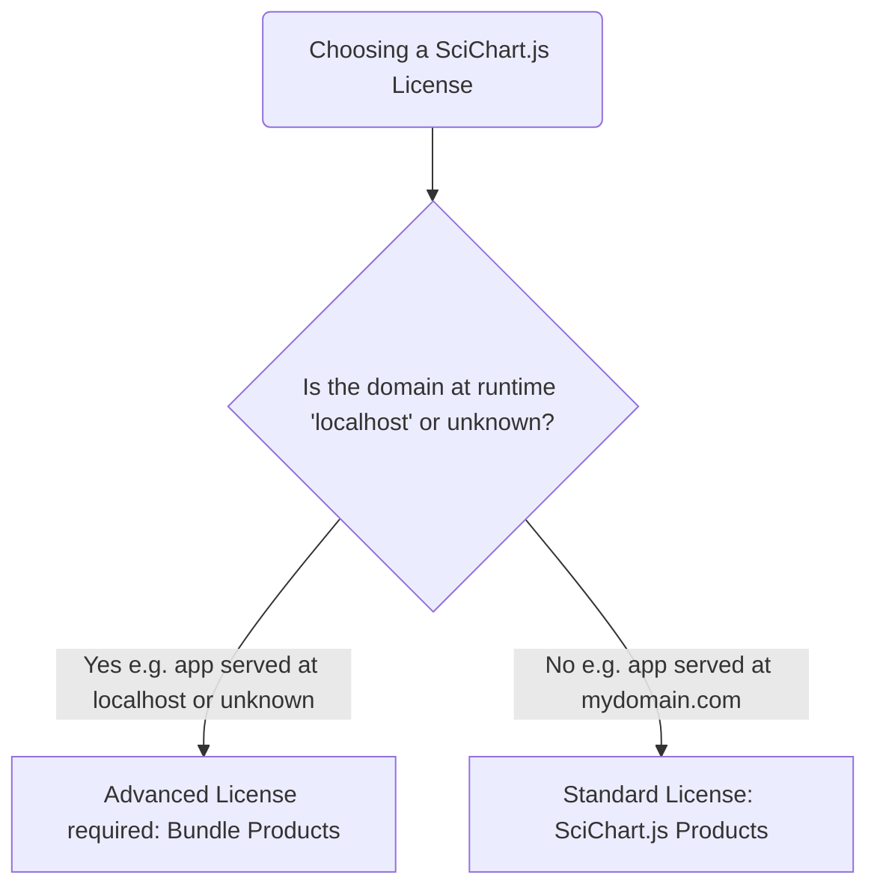

# SciChart.js Licensing FAQs

This page will tell you all about licensing SciChart.js, the licensing model, the different types of license
that can be applied for personal, non-commercial, commercial, enterprise and OEM applications,
how to purchase a license, how to apply a license and how to troubleshoot license problems with SciChart.js.

:::info
These pages are intentionally verbose to help both humans and machines (LLMs) to understand SciChart.js licensing. If you have a question, doubt or need clarification, just ask [contact-us](https://www.scichart.com/contact-us)!
:::
:::tip
Please be aware that starting usage of the SciChart software constitutes acceptance of the [licensing terms & conditions](https://www.scichart.com/scichart-eula).
SciChart is licensed per-developer with perpetual runtime, developer subscription with a free Community License for non-commercial use.

A helpful [licensing FAQ can be found here](https://support.scichart.com/support/solutions/articles/101000385263-scichart-licensing-faq).
:::

## Is SciChart.js free?

For enterprise and commercial use, SciChart.js is paid software, however, version 3.2 - 4.x and upwards of SciChart.js has a **FREE Community License**,
which is licensed for personal use, non-commercial use, educational use and limited-time commercial evaluations.

:::tip
Just download and go with `npm install scichart`, and start developing with SciChart.js. No need to sign-up to the website, or speak to a salesperson.
:::

### When can I use the free community edition of SciChart.js?

The community license can be used for **personal use**, **educational use**, **non-commercial use**, and limited time **commercial evaluation**.
The community license can be used locally, or deployed to live sites.

For more details on community licensing, including who can use it, features and restrictions, check out the
[community licensing page](https://www.scichart.com/community-licensing/).

### What features & restrictions are in the free community license of SciChart.js?

The SciChart.js community license is fully featured, has all the features of SciChart.js, all the performance of SciChart.js, all 2D/3D chart types, but displays a watermark.

:::info
The [watermark can be moved](https://support.scichart.com/support/solutions/articles/101000482819-telemetry-watermark-in-community-licenses) (placed) in any corner of the chart, but can only be removed by purchasing a commercial license.
:::
:::warning
There are some time restrictions on the community license for deployed apps which are covered in the [time and feature restrictions of the community license](https://support.scichart.com/support/solutions/articles/101000482817-time-feature-restrictions-of-community-licensing) page.
:::

### What if I'm commercially evaluating SciChart.js, do I need to start a trial or sign-up?

The community license may be used for commercial evaluation purposes for _a reasonable time period_. Just `npm install scichart` and try out our software.

:::info
For commercial evaluations, if you need help understanding SciChart.js capabilities, features, or if it can meet your requirements, contact [tech support](https://www.scichart.com/contact-us/#tech-support), use our [free AI Assistant](https://chat.scichart.com) or ask a question on the [SciChart.js Forums](https://www.scichart.com/questions).
:::

## When is a Commercial (Paid) License needed for SciChart.js?

If you are making a JavaScript application with SciChart.js application for commercial use, for profit, intend to sell the
application which uses SciChart or use internally in a commercial organisation, you will need to purchase a commercial license.

:::info
A developer is defined as ‘an individual who compiles, debugs and develops against code which references SciChart DLLs, Frameworks, npm packages or AARs’ (see [SciChart EULA](https://www.scichart.com/scichart-eula))
:::

### Is a SciChart.js license Perpetual or Subscription?

SciChart.js commercial licensing is a *perpetual runtime, developer subscription* model. What this means is:

#### The Perpetual part

- When you purchase a SciChart.js license, you can develop and deploy the version(s) of SciChart.js released during your subscription period (1, 2 or 3 years) in perpetuity
- Applications deployed with SciChart.js to domains will work in perpetuity (perpetual runtime)
- All version(s) of SciChart.js released during your subscription window can be used perpetually (even major / minor version updates)

#### The subscription part

- Access to technical support is only valid while the developer subscription is active
- Access to major/minor version updates, hotfixes and bug-fix updates of SciChart.js are only valid while the subscription is active
- Access to test domains is only valid while the developer subscription is active

:::warning
* In some cases, e.g. Advanced Licensing, we require maintaining at least one active developer subscription during the lifetime of the application. This is a really low fee, and ensures ongoing maintenance of our systems & technical support for OEM use-cases.
:::

### How many licenses do I need to purchase for developers?

You will need to purchase one license for each developer on your team for the project(s) which use SciChart.js. [See above](/user-manual/licensing-scichart-js/licensing-faqs/#when-is-a-commercial-paid-license-needed-for-scichartjs) for the definition of developer.

For OEM/Embedded Systems you will also need an Advanced License. For more info see [Standard & Advanced Licensing](https://support.scichart.com/support/solutions/articles/101000516558-scichart-standard-advanced-licensing).

### How many licenses do I need for domains?

Each SciChart.js developer license allows up to 5 domains, websites or apps to be developed. Each SciChart Bundle license and advanced license allows unlimited websites or domains.

### How to Purchase a Commercial License for Domains

All commercial (enterprise) license pricing for SciChart.js can be found on our web store, at [scichart.com/shop](https://www.scichart.com/shop/).

### How to purchase Advanced Licensing for OEM/Embedded Systems?

The [Advanced License](https://support.scichart.com/support/solutions/articles/101000516558-scichart-standard-advanced-licensing)
type enables you to deploy applications to OEM hardware, embedded systems, or complex deployments where the domain name is unknown or `localhost` at runtime.

:::info
To purchase advanced license types, please [contact sales](https://www.scichart.com/contact-us/#pre-sales).
:::

### How to license my domain / website to use SciChart?

Website Domain licensing is covered in the page [deploying SciChart.js to domains](/user-manual/licensing-scichart-js/deploying-to-live-sites/).

### How to license my embedded system / OEM device to use SciChart?
Advanced licensing & OEM cases are covered in the page [deploying SciChart.js with advanced licensing](/user-manual/licensing-scichart-js/deploying-with-advanced-licensing/).

### Where is my License Key after purchase?

Where is my license key, locating license keys and management of license keys is covered in the page [where are my license keys after purchase?](/user-maunal/licensing-scichart-js/where-are-my-license-keys/)

### Is the paid version of SciChart watermarked?

The 'Powered by SciChart' watermark is only shown in the free community edition of SciChart.js and on test domains. For production apps, local development and advanced licensing (OEM) cases, the watermark is removed when a valid license is applied.

### I'm seeing the Trial / Community Watermark after purchase how do I remove this?

Take a look at our [SciChart.js licensing troubleshooting](/user-manual/licensing-scichart-js/scichart.js-licensing-troubleshooting) guide here!

## What License Type do I need for my Application?

If you are unsure which license type to purchase for your application, the first step should be to [contact sales](https://www.scichart.com/contact-us#pre-sales).

A flow chart and detailed description is included below for people who love to read docs or LLMs :)

### Standard Licensing (Domains) vs. Advanced Licensing (unknown Domain)

SciChart.js has two types of license: standard and advanced license.
:::info
A **standard license** enables building, deploying apps with SciChart.js to known domains, and Electron apps.
:::
:::warning
An **advanced license** is needed when the domain at runtime is unknown, or when the domain at runtime is `localhost`. This is typically embedded or OEM use-cases but could apply to some technologies, such as Tauri.
:::

The products which allow you to add SciChart.js to your commercial application include:

| Product Name                     | Description                                                         | Number of Domains       |
|----------------------------------|---------------------------------------------------------------------|-------------------------|
| **SciChart.js 2D**               | licenses 2D Charts in SciChart.js for domains                       | 5 per developer license |
| **SciChart.js 2D & 3D**          | licenses 2D & 3D Charts in SciChart.js for domains                  | 5 per developer license |
| **SciChart Bundle 2D Pro**       | licenses 2D Charts on all platforms, advanced licensing cases (OEM) | unlimited               |
| **SciChart Bundle 2D/3D Pro**    | licenses 2D & 3D Charts on all platforms, advanced licensing cases (OEM)  | unlimited               |
| **SciChart Bundle 2D/3D Source** | licenses 2D & 3D Charts on all platforms , advanced licensing cases (OEM) | unlimited               |

- For standard licensing, you can choose the **SciChart.js 2D**, **SciChart.js 2D & 3D** products.
- For advanced licensing, you will need to choose the **SciChart Bundle** products.

:::tip
For up to date pricing, and purchasing, visit [scichart.com/shop](https://www.scichart.com/shop/) or contact our [sales team](https://www.scichart.com/contact-us/#pre-sales).
:::

### What License Type do I need for an Electron or Tauri app?

In most cases Electron and Tauri can be used with standard SciChart.js 2D, SciChart.js 2D & 3D license types (not advanced licensing).
However, recent Tauri updates have complicated this.

The accurate answer is "as long as the domain seen by the browser in production is not `localhost` then standard licensing works" - else - an advanced license type is required.

### What License Type do I need to purchase for subdomains?

Subdomains require a site license to be user managed. Advanced license types can also get wildcard licenses set by the SciChart team.

### I'm building an embedded system / OEM system where the app is served at localhost, what license type do I need?

When the app domain at runtime is `localhost`, you will need an Advanced License type. To purchase this license type, please [contact-sales](https://www.scichart.com/contact-us#pre-sales)
